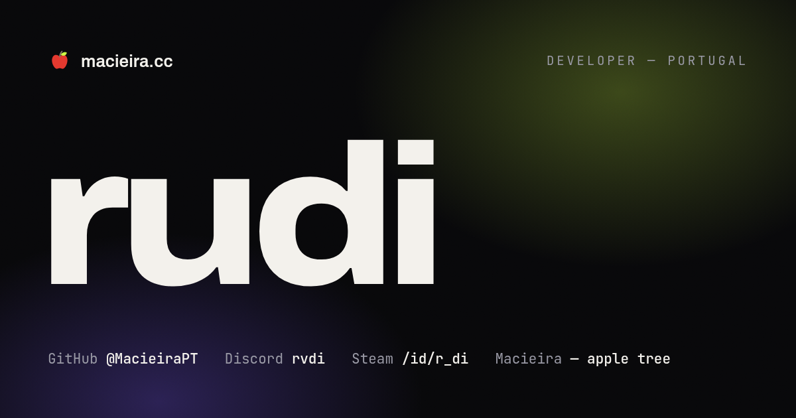

<div align="center">


# macieira.cc

**A personal site that is also an apple tree.**

*Macieira* is Portuguese for **apple tree**, and it's my surname.
So the front page isn't a photo and a paragraph. It's a tree,
whose seven apples are the only introduction there is.

[**↗ Visit the site**](https://macieira.cc) · [@MacieiraPT](https://github.com/MacieiraPT)

<br>



<br>


</div>

<br>

---

## Contents

- [What this is](#what-this-is)
- [The tree](#the-tree)
- [What's on the page](#whats-on-the-page)
- [Two languages](#two-languages)
- [Under the hood](#under-the-hood)
- [When things break](#when-things-break)
- [Whose site this is](#whose-site-this-is)
- [Credits](#credits)

---

## What this is

The personal site of **Rodrigo Macieira** — a developer in Portugal, 18, early in the work and
building where it can be seen. It lives at **[macieira.cc](https://macieira.cc)**.

The brief was small and stubborn: put **one big idea on the first screen** instead of five
small ones, and let everything else earn its place underneath. The one big idea is the
tree. Everything else on the page is short enough to read standing up.

There are exactly **three links** — Steam, Discord, GitHub. That's the whole list, and the
page says so out loud.

---

## The tree

The hero is a tree that isn't drawn — it's **grown**. One recursive generator starts from a
single seed and branches outward, and the geometry follows the rules a real tree follows:

- Every limb starts *inside* its parent, so the wood is continuous rather than assembled.
- Radii follow the **pipe model** — a fork's children share out the parent's cross-section —
  so branches thin the way branches actually thin.
- The trunk widens into its roots along one unbroken curve.
- A couple of thousand leaves scatter through the volume *around* each outer branch, not
  laid on its surface — it's the spread that makes a canopy instead of a garland.

The seed is fixed, so **the same tree grows for everybody**, on every load, in every browser.

### The apples are hidden, and that's the point

Seven apples hang where the tree grew them. That means some are behind the trunk, most are
half under leaves, and finding them is the interaction. **Drag anywhere to turn the tree** —
free in yaw, with inertia on release and a slow idle drift, so it reads as turnable before
you touch it. Each apple you click opens one card: the name, the person, the training, the
stack, and the three places to find him.

Two details worth knowing, because they're what makes it feel fair rather than fiddly:

- **An apple you can't see is never a hit target you can't see.** Fruit facing away fades
  out *and* stops taking clicks, so you never hit something invisible or miss something you
  can plainly see.
- **Keyboard works in reverse.** Tab still reaches all seven — and focusing one that has
  turned away **spins the tree around to face you**. It's the accessible answer and the
  nicest thing in the scene.

The idle spin also pauses the moment you hover an apple, because a target that drifts under
your cursor as you reach for it is a target you miss.

---

## What's on the page

| | |
| --- | --- |
| **Hero** | The tree, the name, and the local time in Portugal. |
| **01 — now** | Shipped, working on, next. Three sentences, no roadmap theatre. |
| **02 — elsewhere** | Steam, Discord, GitHub. Handles that aren't links copy to your clipboard. |
| **03 — github** | A live panel read straight from the public GitHub API: profile counters, recent repositories, and a 14-day activity strip. Nothing is typed in by hand. |
| **Selected work** | Projects, as they arrive. The grid ships as real markup and `work.js` re-renders it from `js/data/projects.js`, so it is never blank for a crawler or without JS. |
| **04 — contact** | Two buttons, and a corner of draggable stickers you can throw around. |

Behind all of it, a second WebGL scene: **26,000 points** drifting as a haze, morphing into
a wave, and settling into the shape of the apple mark.

---

## Two languages

The whole page reads in **English and European Portuguese**, switched from the pill in the
masthead. A Portuguese browser lands in Portuguese without touching it, the choice is
remembered, and `?lang=pt` forces it — which is what makes a Portuguese link shareable.

The translation is not a JSON file and not a second page. Every translatable element
carries its Portuguese next to its English, in the markup:

```html
<p class="card__label" data-pt="Publicado">Shipped</p>
```

English is what ships in the document, so a visitor with no JavaScript — or a crawler —
gets the finished page and never a flash of translation keys; switching swaps one attribute
for the other. The English is copied back into `data-en` on boot, before anything else has
touched the DOM, which is also what lets *cloned* content (the marquee duplicates its own
track) arrive knowing both languages instead of being stranded in whichever one happened to
be showing.

It isn't only the copy. The headlines are re-split and re-measured for the new line breaks,
the clock and the GitHub panel's counters and relative dates change locale, and the panel
redraws itself from the response it already had — no second request to say the same thing
in Portuguese.

---

## Under the hood

No framework. No bundler. No CMS. What's in the repository is exactly what the browser gets.

| Library | Job on this page |
| --- | --- |
| [Lenis](https://github.com/darkroomengineering/lenis) | The inertia in the scroll — the base *feel* of the page. Nothing else animates on its own clock. |
| [GSAP](https://gsap.com) + ScrollTrigger | The hero intro, every scroll reveal, the pinned rail, the progress bar. |
| [Three.js](https://threejs.org) | Both scenes: the tree, and the particle field behind everything. |
| [anime.js](https://animejs.com) | The fine detail — SVG line-drawing, the apple → GitHub morph, and the spring-physics stickers. |

The clearest place to see them working as **one system** rather than four is the marquee
between sections 01 and 02: GSAP runs the loop, its speed and skew come from Lenis' scroll
velocity, and ScrollTrigger decides when to reset it.

**The buttons are always HTML.** All seven apples are real `<button>` elements and all seven
facts are real `<article>` elements, sitting in the document from the start. The 3D tree is
a *renderer*, not a rewrite — each frame it projects the fruit's position and moves the
buttons to sit on the mesh. Tab order, Enter, Space, focus rings and screen-reader output
are identical whether WebGL runs or not, because they're the same elements either way.

**Nothing loads that isn't needed.** The critical path is about 70 kB gzipped; the GitHub
panel, the animation detail and all of Three.js wait for the browser to be idle. The one
exception asked for immediately is the tree — it's the front page.

The approach owes its shape to [OFF+BRAND](https://www.itsoffbrand.com) — bold type, one
heavy motion layer, cinematic scroll, and a hard performance budget — minus the CMS, because
this page has to survive with JavaScript switched off.

---

## When things break

Every degradation is a designed state, not an accident:

| Situation | What you get |
| --- | --- |
| **JavaScript disabled** | The entire page, fully readable in English — including a hand-drawn SVG tree with working buttons and all the facts as plain text. Nothing is hidden without JS; the language switch takes itself off the page rather than pretending to work, and the browser's own scrollbar stays where it is instead of being removed for a replacement that will never arrive. |
| **No WebGL** | The SVG tree takes over, buttons and all. Three.js is never even downloaded. |
| **Only one WebGL context** | The tree wins it — it's content. The particle field falls back to CSS gradients without a word. |
| **No GPU at all** | Still runs, on the software renderer, at a lower particle count. |
| **GitHub API down or rate-limited** | The panel says `offline` and explains itself. The link to the profile never depended on the fetch. |
| **Slow frames** | A watchdog quietly drops the pixel ratio, then the foliage, until it's smooth again. |

**`prefers-reduced-motion`: reduce, don't remove.** Both extremes were tried here and
both were wrong. Honouring it by switching everything off left half the page animating and
the other half sitting still, which reads as broken rather than as considerate. Ignoring it
outright was worse in a quieter way — the claim that justified it ("no parallax on body
text") wasn't even true, since the hero block scrubs on scroll, headline included.

The line that holds is not *how much* motion but *who started it*. Reactive motion stays:
the smooth scroll and the tree answer a wheel, a drag or a click, and they stop when you
do. Self-starting motion goes: the marquee, the pulsing status dots, the scroll cue, the
idle bob in the canopy, the hero parallax and the entrance reveals all run without being
asked, and looping ones with no pause control are a WCAG 2.2.2 failure besides. CSS start
states are released in the reduced-motion block at the bottom of `base.css`; tweens are
skipped by the module that owns them. The two halves have to agree — release an element in
CSS while its tween still runs and it flashes.

---

## Whose site this is

**Rodrigo Macieira** — *Programador de Informática* (Level 4, Quadro Nacional de Qualificações),
Portugal. Currently on real-time graphics for the web, and the performance work that keeps
them running on a phone as well as a desktop.

<div align="center">

[](https://macieira.cc)
[](https://github.com/MacieiraPT)
[](https://steamcommunity.com/id/r_di/)

Discord: **rvdi**

</div>

---

## Credits

Brand icon paths from [simple-icons](https://simple-icons.org) (CC0); each mark identifies
the service its link points to. Type is [Archivo](https://fonts.google.com/specimen/Archivo)
and [JetBrains Mono](https://www.jetbrains.com/lp/mono/), both OFL, self-hosted as latin
subsets.

<div align="center">
<br>

<br><br>
<sub>Grown, not drawn.</sub>
</div>
